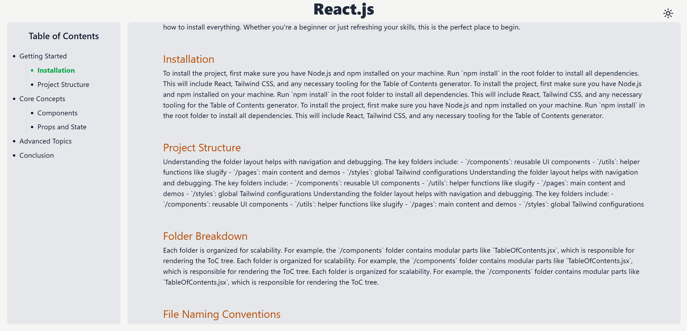
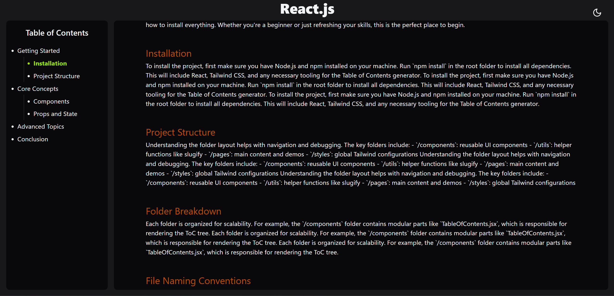
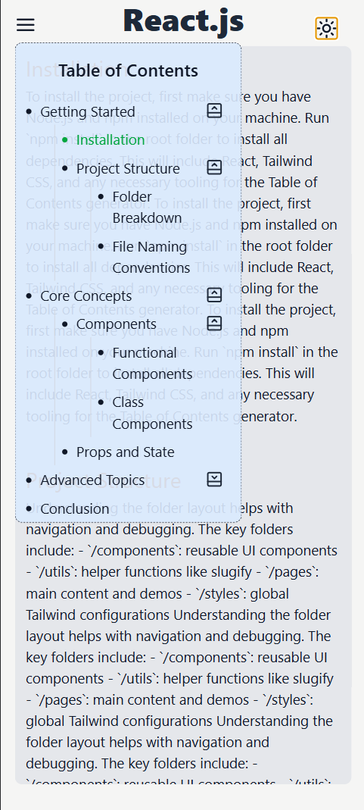
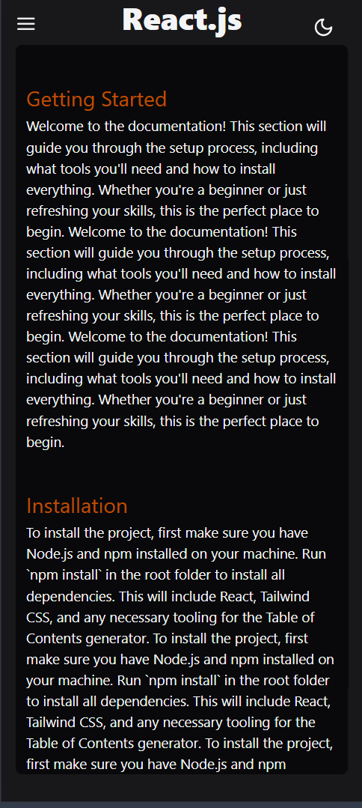

# DevifyX Assignment – React Table of Contents App

A responsive React app built with Vite that demonstrates a dynamic, collapsible Table of Contents (ToC) with scrollspy, dark mode, and more.

---

## 🚀 Features

-   **Dynamic Table of Contents**  
    Generates ToC from flat or nested heading data, supports arbitrary depth.

-   **Collapsible Subheadings**  
    Subheadings can be expanded/collapsed with smooth animation.

-   **Scrollspy**  
    Highlights the active section in the ToC as you scroll.

-   **Smooth Scroll**  
    Clicking a ToC item smoothly scrolls to the corresponding section.

-   **Dark Mode**  
    Toggle dark/light theme, with preference saved in localStorage.

-   **Responsive Design**  
    Sidebar auto-hides on small screens, can be toggled with a button.

-   **Customizable ToC**
    -   Set ToC title tag (e.g., h2, h3)
    -   Limit max depth rendered
    -   Toggle collapsibility
    -   Set active color/class

---

## 🛠️ Setup & Run Instructions

1. **Clone the repository**

    ```bash
    git clone (https://github.com/NitinTSutar/Assignment-Devify.git)
    cd DevifyX_assignment
    ```

2. **Install dependencies**

    ```bash
    npm install
    ```

3. **Start the development server**

    ```bash
    npm run dev
    ```

4. **Open in your browser**  
   Visit [http://localhost:5173](http://localhost:5173)

---

## 📸 Screenshots

Below are some screenshots of the app in action:

<!-- Desktop view in Light Mode -->


<!-- Desktop view in Dark Mode -->



<div style="display: flex; gap: 10px; align-items: flex-start;">
  
  
  
  
</div>

---

## 🤖 AI Tools Disclosure

This project’s code, documentation, and/or README were assisted by **GitHub Copilot** (powered by OpenAI GPT-4) for code suggestions, explanations, and formatting.
